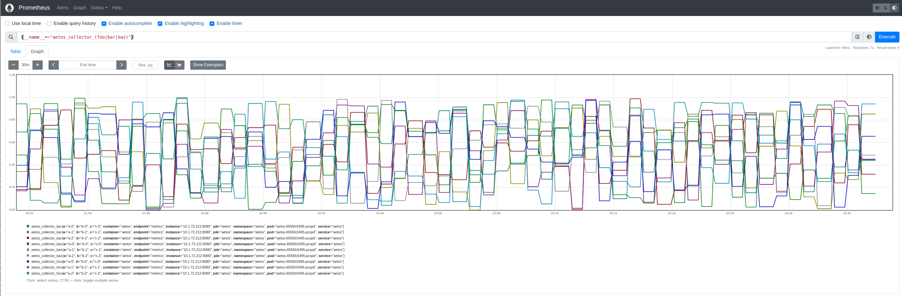

[Aëtos](https://en.wikipedia.org/wiki/A%C3%ABtos)

[](https://github.com/DazWilkin/Aetos/actions/workflows/build.yml)
[](https://pkg.go.dev/github.com/DazWilkin/Aetos)
[](https://goreportcard.com/report/github.com/DazWilkin/Aetos)

Named after the eagle that tested Prometheus.

An exporter intended for testing PromQL queries. The exporter is configured dynamically (by `POST`'ing to its `/publish` endpoint see [publish](#publish)) to generate a set of gauge metrics with a set of labels with predictable labels values and random measurement values.



> **NOTE** The PromQL used in the above uses the special label `__name__` to apply a regex across 3 Aetos metric (!) names (`aetos_colllector_foo`,`aetos_colllector_bar`,`aetos_colllector_baz`) to return them as one result (`{__name__=~"aetos_collector_(foo|bar|baz)}`).

## Important

Upon launch Aetos only includes two metrics:

|Name|Type|Description|
|----|----|-----------|
|`aetos_collector_build_info`|Counter|A metric with a constant value of 1 but labeled with build info|
|`aetos_collector_start_time`|Gauge|Aetos collector start time in Unix epoch seconds|

## protoc

```bash
MODULE="github.com/DazWilkin/Aetos"
protoc \
--proto_path=${PWD} \
--go_out=${PWD} \
--go_opt=module=${MODULE} \
${PWD}/api/v1alpha1/aetos.proto
```

## Run

### Local

```bash
go run github.com/DazWilkin/Aetos/cmd \
--cardinality=3 \
--endpoint=:8080 \
--labels=3 \
--metrics=3 \
--path=/metrics
```

### Podman

```bash
IMAGE="ghcr.io/dazwilkin/aetos:65bffe4ea8f7695b4cf5ce9535e2036e83380991"
PORT="8080"

# Revise
CARDINALITY="3" # Max  10
LABELS="3"      # Max   5
METRICS="3"     # Max 250

podman run \
--interactive --tty --rm \
--publish=${PORT}:8080 \
${IMAGE} \
--cardinality=${CARDINALITY} \
--endpoint="0.0.0.0:8080" \
--labels=${LABELS} \
--metrics=${METRICS}
```

Then browse `http://localhost:{PORT}` replacing `{PORT}` with the value of `${PORT}`

### Kubernetes

Uses [Jsonnet](https://jsonnet.org/) to generate the Kubernetes config.

```bash
IMAGE="ghcr.io/dazwilkin/aetos:65bffe4ea8f7695b4cf5ce9535e2036e83380991"
PORT="8080"

# Revise
CARDINALITY="3" # Max  10
LABELS="3"      # Max   5
METRICS="3"     # Max 250

NAMESPACE="aetos"

kubectl create namespace ${NAMESPACE}

jsonnet \
  ./kubernetes.jsonnet \
  --ext-str image="${IMAGE}" \
  --ext-str port="${PORT}" \
  --ext-str cardinality="${CARDINALITY}" \
  --ext-str labels="${LABELS}" \
  --ext-str metrics="${METRICS}" \
| kubectl apply \
  --filename=- \
  --namespace=${NAMESPACE}
```

Confirm the deployment is successful:

```bash
kubectl get pod \
--selector=app=aetos \
--namespace=${NAMESPACE} \
--output=jsonpath="{.items[0].status.containerStatuses[0].ready}"
```
```console
true
```

If using Tailscale [Kubernetes operator](https://tailscale.com/kb/1236/kubernetes-operator) see [Tailscale](#tailscale)

If you wish to simply proxy Aetos locally:

```bash
kubectl port-forward service/aetos \
--namespace=${NAMESPACE}
${PORT}:${PORT}
```
And then browse `http://localhost:{PORT}` replacing `{PORT}` with the value of `${PORT}`

Or if you can access a cluster NodePort:

```bash
NODE_PORT=$(\
  kubectl get service/aetos \
  --namespace=${NAMESPACE} \
  --output=jsonpath='{.spec.ports[?(@.name=="api")].nodePort}') && echo ${NODE_PORT}
```

And then browse `http://localhost:{NODE_PORT}` replacing `{NODE_PORT}` with the value of `${NODE_PORT}`

## API

### Publish (`/publish`)

The following will generate 3 metrics each with 3 labels:

```
foo{a="...",b="...",c="..."}
bar{a="...",b="...",c="..."}
baz{a="...",b="...",c="..."}
```

|Name|Type|Description|
|----|----|-----------|
|`foo`|Gauge|a randomly generated metric with 3 labels with cardinality 3|
|`bar`|Gauge|a randomly generated metric with 3 labels with cardinality 3|
|`baz`|Gauge|a randomly generated metric with 3 labels with cardinality 3|

```bash
DATA='
{
    "labels":[
        "a",
        "b",
        "c"
    ],
    "metrics":[
        "foo",
        "bar",
        "baz"
    ]
}
'

curl \
--request POST \
--data "${DATA}" \
http://localhost:8080/publish
```

### Healthz (`/healthz`)

Static | Not implemented

```bash
curl \
--silent \
--request GET \
http://localhost:8080/healthz \
| jq -r .
```
```console
ok
```


### Varz (`/varz`)

```bash
curl \
--silent \
--request GET \
http://localhost:8080/varz \
| jq -r .
```
```JSON
{
  "labels": [
    "a",
    "b",
    "c"
  ],
  "metrics": [
    "foo",
    "bar",
    "baz"
  ]
}
```

## Metrics

Metrics will be empty until a configuration is `/publish`'ed (see [Publish](#publish))

Then:

```console
# HELP aetos_collector_bar a randomly generated metric with 3 labels with cardinality 3
# TYPE aetos_collector_bar gauge
aetos_collector_bar{a="a-0",b="b-0",c="c-0"} 0.4370108094286117
aetos_collector_bar{a="a-1",b="b-1",c="c-1"} 0.164219079866473
aetos_collector_bar{a="a-2",b="b-2",c="c-2"} 0.14382614145278458
# HELP aetos_collector_baz a randomly generated metric with 3 labels with cardinality 3
# TYPE aetos_collector_baz gauge
aetos_collector_baz{a="a-0",b="b-0",c="c-0"} 0.5501234459761718
aetos_collector_baz{a="a-1",b="b-1",c="c-1"} 0.5444040787463975
aetos_collector_baz{a="a-2",b="b-2",c="c-2"} 0.7750368437739439
# HELP aetos_collector_foo a randomly generated metric with 3 labels with cardinality 3
# TYPE aetos_collector_foo gauge
aetos_collector_foo{a="a-0",b="b-0",c="c-0"} 0.87781623201731
aetos_collector_foo{a="a-1",b="b-1",c="c-1"} 0.9076335347948783
aetos_collector_foo{a="a-2",b="b-2",c="c-2"} 0.1317955488606491
```

## Prometheus

### Operator

A `ServiceMonitor` named `aetos` is included with the [`kubernetes.jsonnet`](./kubernetes.jsonnet) file.

### Local

```bash
PORT="9090"

podman run \
--interactive --tty --rm \
--net=host \
--volume=${PWD}/prometheus.yml:/etc/prometheus/prometheus.yml \
prom/prometheus \
--config.file=/etc/prometheus/prometheus.yml \
--web.listen-address="0.0.0.0:${PORT}"
```

## Tailscale

If you're using Tailscale [Kubernetes operator](https://tailscale.com/kb/1236/kubernetes-operator), you can expose Aetos to your Tailnet by applying [`tailscale.jsonnet`](./tailscale.jsonnet):

```bash
HOST="..."
PORT="8080"

jsonnet \
  ./tailscale.jsonnet \
  --ext-str host=${HOST} \
  --ext-str port=${PORT} \
| kubectl apply \
  --filename=- \
  --namespace=${NAMESPACE}
```

## Sigstore

`aetos` container images are signed by [Sigstore](https://www.sigstore.dev/) and may be verified:

```bash
cosign verify \
--key=./cosign.pub \
ghcr.io/dazwilkin/aetos:65bffe4ea8f7695b4cf5ce9535e2036e83380991 \
2>/dev/null \
| jq -r .
```

> **NOTE** `cosign.pub` may be downloaded [here](./cosign.pub)

To install `cosign`, e.g.:

```bash
go install github.com/sigstore/cosign/cmd/cosign@latest
```


<hr/>
<br/>
<a href="https://www.buymeacoffee.com/dazwilkin" target="_blank"></a>